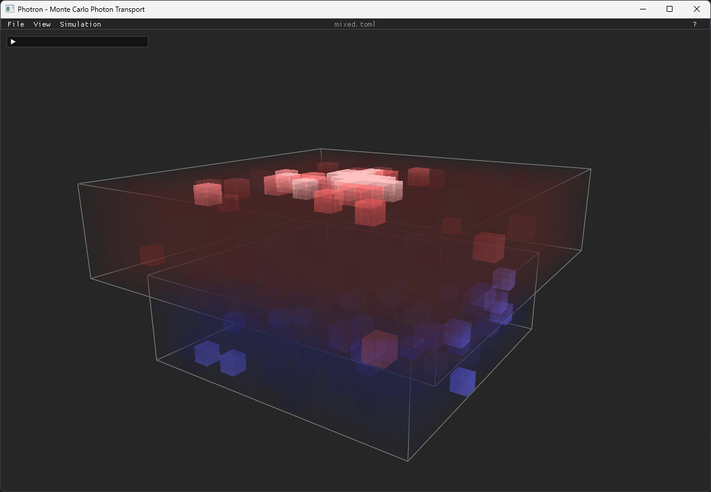
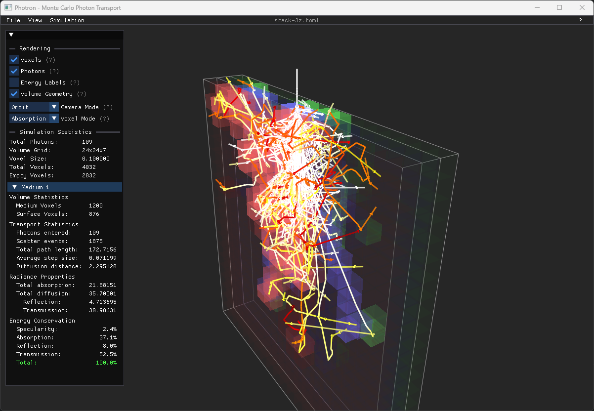
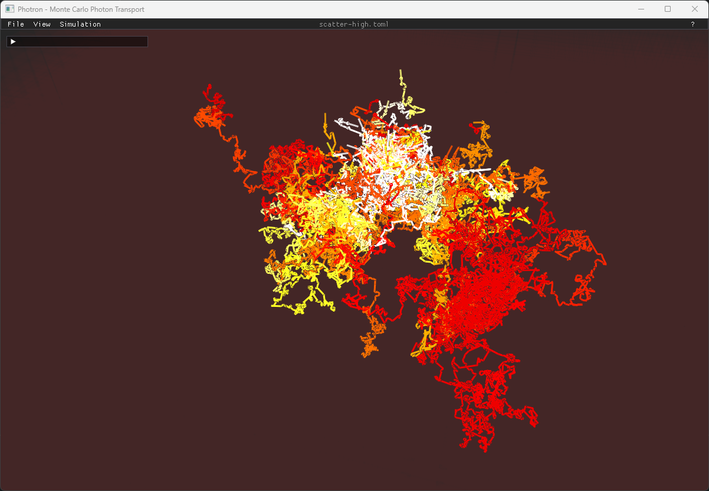

<!-- markdownlint-disable MD033 -->

# Photron

**Monte Carlo Photon Transport Simulation and Interactive 3D Visualization**  
Maurits Lam  
2025

<p align="center">
   
</p>

**Photron** is a Monte Carlo photon transport simulator with real-time 3D visualization for analyzing subsurface light transport in multi-layered materials. Built on C++20 and OpenGL 4.5, it combines the proven MCML algorithm with modern rendering for accurate simulation and intuitive visualization of photon behavior in complex geometries.

## Key Features

<table align="center">
   <tr>
      <td align="center"><br><strong>Energy Deposition Visualization</strong></td>
      <td align="center"><br><strong>Multi-Layer Geometry</strong></td>
      <td align="center"><br><strong>Interactive Path Tracing</strong></td>
   </tr>
</table>

- **Monte Carlo Photon Transport**: MCML-based algorithm for accurate subsurface light transport simulation
- **Multi-Layered Materials**: Complex geometries with varying optical properties (absorption, scattering, anisotropy, refractive index)
- **Real-Time 3D Visualization**: Interactive OpenGL rendering with energy mapping and photon path tracing
- **Voxelized Energy Tracking**: High-resolution 3D grids for spatial energy deposition analysis
- **Multiple Render Modes**: Absorption, emission, volumes, and photon trajectories
- **3D DDA & BVH**: Optimized algorithms for precise voxel traversal and ray-triangle intersection

## User Guide

### Running Simulations

**Interactive Mode**: Launch with configuration file for GUI with real-time visualization

```bash
./Photron.exe config/default.toml
```

**Headless Mode**: Run simulation without GUI for batch processing

```bash
./Photron.exe config/default.toml --headless
```

**Configuration Loader**: Start without arguments to browse and select config files

```bash
./Photron.exe
```

### Controls

- **Camera**: Mouse to orbit, scroll to zoom, WASD for movement
- **Rendering**: Toggle modes (F1-F4), adjust parameters in GUI panels
- **Simulation**: Run/pause, launch additional photons, export results
- **Help**: Hover over (?) tooltips for detailed control explanations

Run `./Photron.exe --help` for complete command-line options.

### Configuration

Photron uses **TOML** files to define simulations. Key parameters include:

- **Refractive Index (eta)**: Material interface behavior (1.0-3.0)
- **Absorption (mua)** & **Scattering (mus)**: Energy interaction coefficients  
- **Anisotropy (ani)**: Scattering directionality (-1.0 to +1.0)

Example configurations: `default.toml` (basic box), `sphere.toml` (spherical geometry), `nested.toml` (multi-layer), `absorption.toml` (high absorption).

#### Example Configuration

```toml
[general]
photons = 100                 # Number of Monte Carlo photons
voxel_size = 0.01             # Voxel edge length in cm
log = false                   # Enable/disable detailed logging
deterministic = false         # Random or fixed seed

[source]
position = [0.0, 0.2, 0.0]    # Light source position (cm)
direction = [0, -1, -0.5]     # Emission direction (normalized)

[[layer]]
eta = 1.37                    # Refractive index
mua = 1.0                     # Absorption coefficient (1/cm)
mus = 10.0                    # Scattering coefficient (1/cm) 
ani = 0.1                     # Anisotropy factor (-1 to +1)

# 3D mesh geometry definition
vertices = [
    [-1.0,  0.0,  1.0],       # Vertex coordinates in cm
    [ 1.0,  0.0,  1.0],       # ... additional vertices
]

faces = [
    [0, 1, 2],                # Triangle face indices
    [0, 2, 3],                # ... additional faces
]
```

## Technical Implementation

### Core Algorithms

- **Monte Carlo Photon Transport**: MCML-based with Henyey-Greenberg scattering and Fresnel interfaces.
- **3D Digital Differential Analyzer**: Precision-safe voxel traversal with O(n) complexity.
- **Bounding Volume Hierarchy**: SAH-optimized construction with O(log n) ray intersection.
- **GPU Instanced Rendering**: Efficient batch rendering of millions of voxels and path segments.

### Applications

- **Material Science**: Subsurface scattering analysis in translucent materials.
- **Computer Graphics**: Realistic subsurface scattering for material rendering. 
- **Optical Engineering**: Light guide design and component optimization.
- **Physics Education**: Interactive photon transport demonstrations.

## Building and Dependencies

### Requirements

- **C++ Compiler**: C++20 support (MSVC 2022, GCC 11+, Clang 13+).
- **CMake**: 3.20 or higher for modern CMake features.
- **vcpkg**: Package manager for dependency resolution.
- **OpenGL**: 4.5 or later and a supported GPU.

### Libraries

- [GLFW 3.4](https://www.glfw.org/)
- [GLEW 2.2](http://glew.sourceforge.net/)
- [GLM 1.0](https://github.com/g-truc/glm)
- [ImGui 1.91](https://github.com/ocornut/imgui)
- [cxxopts 3.3](https://github.com/jarro2783/cxxopts)
- [toml++ 3.4](https://github.com/marzer/tomlplusplus)

### Build Instructions

#### Windows (Visual Studio)

```powershell
# Clone repository
git clone https://github.com/mhjlam/photron.git
cd photron

# Configure with vcpkg
cmake -S . -B build -DCMAKE_TOOLCHAIN_FILE="$ENV:VCPKG_ROOT/scripts/buildsystems/vcpkg.cmake"

# Build debug version  
cmake --build build --config Debug

# Build release version
cmake --build build --config Release
```

## File Structure

```txt
Photron/
├── bin/                # Executable output and runtime files
│   ├── config/         # Configuration files copied for runtime
│   ├── out/            # Output directory for simulation results
│   └── shaders/        # GLSL shader files copied for runtime
├── build/              # CMake build outputs and intermediate files
├── config/             # Source configuration files (TOML format)
├── shaders/            # Source GLSL shader programs
├── src/                # C++ source code (coordination layer)
│   ├── common/         # Shared utilities (error handling, file I/O)
│   ├── math/           # Mathematical algorithms (DDA, BVH, geometry)
│   ├── renderer/       # OpenGL rendering and photon visualizer
│   └── simulator/      # Monte Carlo simulation engine
├── CMakeLists.txt      # CMake build configuration
└── vcpkg.json          # Dependency manifest for vcpkg
```

## Acknowledgments

- The MCML algorithm is based on the Monte Carlo Multi-Layered algorithm by Wang & Jacques (1996).
- DDA Implementation inspired by "A Fast Voxel Traversal Algorithm" by Amanatides & Woo (1987).
- Bounding Volume Hierarchy and Surface Area Heuristic optimizations from modern ray tracing literature.

## License

This software is licensed under the [GNU General Public License v3.0](https://www.gnu.org/licenses/gpl-3.0.html). See [COPYING](COPYING) for details.
